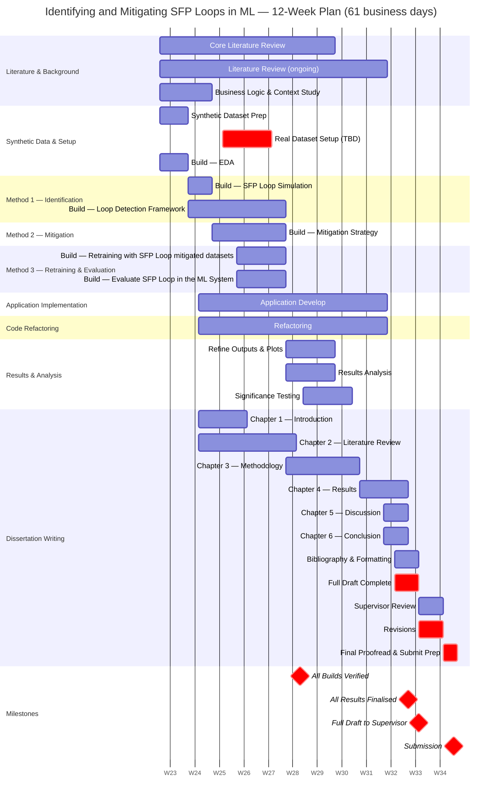

# Identifying and Mitigating Self-Fulfilling Prophecy Loops in Machine Learning

```mermaid
%%{init: {'theme': 'default', 'useMaxWidth': false, 'useWidth': 3000, 'gantt': {'fontSize': 12, 'barHeight': 28, 'barGap': 10, 'topPadding': 60, 'sidePadding': 60, 'leftPadding': 260, 'rightPadding': 40}}}%%
gantt
    title Identifying and Mitigating SFP Loops in ML — 12-Week Plan (61 business days)
    dateFormat  YYYY-MM-DD
    axisFormat  W%W
    tickInterval 1week

    section Literature & Background
    Core Literature Review            : 2026-06-11, 2026-07-31
    Literature Review (ongoing)       :2026-06-11, 2026-08-15
    Business Logic & Context Study    :2026-06-11, 2026-06-26

    section Synthetic Data & Setup
    Synthetic Dataset Prep    :2026-06-11, 2026-06-19
    Real Dataset Setup (TBD) :crit, 2026-06-29, 2w 
    Build — EDA        :2026-06-11, 2026-06-19

    section Method 1 — Identification
    Build — SFP Loop Simulation      :2026-06-19, 2026-06-26
    Build — Loop Detection Framework :2026-06-19, 2026-07-17

    section Method 2 — Mitigation
    Build — Mitigation Strategy   :2026-06-26, 2026-07-17
    
    section Method 3 — Retraining & Evaluation 
    Build — Retraining with SFP Loop mitigated datasets   :2026-07-03, 2026-07-17
    Build — Evaluate SFP Loop in the ML System            :2026-07-03, 2026-07-17

    
    section Application Implementation 
    Application Develop: 2026-06-22, 2026-08-15
    
    section Code Refactoring 
    Refactoring    :2026-06-22, 2026-08-15

    
    section Results & Analysis
    Refine Outputs & Plots        :2026-07-17, 2w
    Results Analysis              :2026-07-17, 2w
    Significance Testing          :2026-07-22, 2w

    section Dissertation Writing 
    Chapter 1 — Introduction      :2026-06-22, 2w
    Chapter 2 — Literature Review :2026-06-22, 4w
    Chapter 3 — Methodology       :2026-07-17, 3w
    Chapter 4 — Results           :2026-08-07, 2w
    Chapter 5 — Discussion        :2026-08-14, 1w
    Chapter 6 — Conclusion        :2026-08-14, 1w
    Bibliography & Formatting     :2026-08-17, 1w
    
    
    Full Draft Complete           :crit, 2026-08-17, 1w 
    Supervisor Review             :2026-08-24, 1w
    Revisions                     :crit, 2026-08-24, 1w
    Final Proofread & Submit Prep :crit, 2026-08-31, 4d

    section Milestones
    All Builds Verified           :milestone, crit, 2026-07-21, 0d
    All Results Finalised         :milestone, crit, 2026-08-21, 0d
    Full Draft to Supervisor      :milestone, crit, 2026-08-24, 0d
    Submission                    :milestone, crit, 2026-09-03, 0d
```
